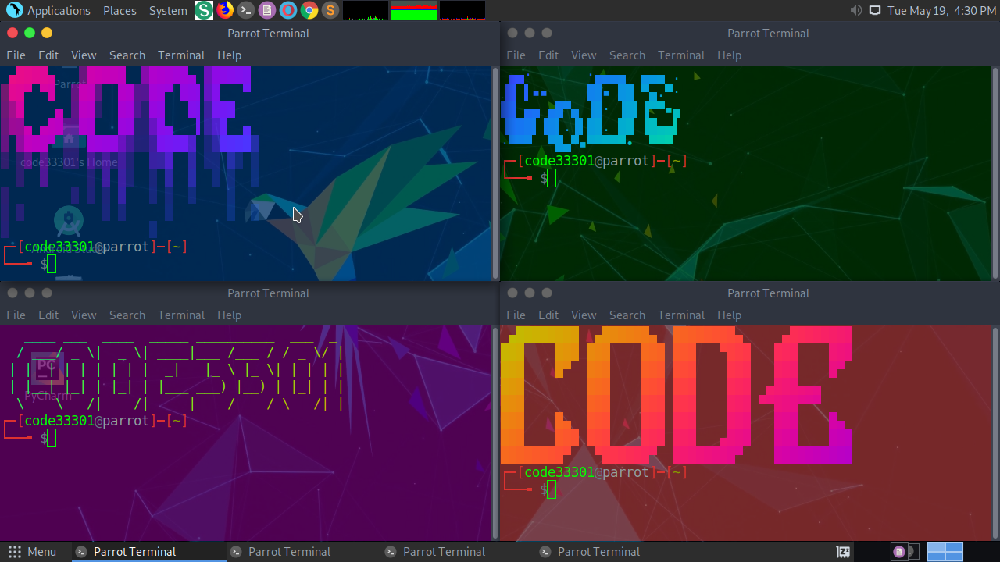

# Terminal-Cool-Text
## 5/20/2020

***Note: Background Color Not Included!***
[For Background Color](https://github.com/CODE33301/Multiple-Color-Terminal)

Instructions:

1. Install lolcat, For Color 
Deb: sudo apt install lolcat 
Arch: sudo pacman -S lolcat

2. Create CoolText Folder, To Store The Cool Text Files 
mkdir /home/$USER/CoolText

3. Files 
Find some cool ASCII art and put them in a file, you can have multiple text/ASCII files
and add all of them in the CoolText Folder. DO NOT ADD A SPACE WHEN NAMEING THE FILES!!!

4. Code 
Copy and past my code to .bashrc at the very end of the file.
nano /home/$USER/.bashrc

Enjoy!!!
